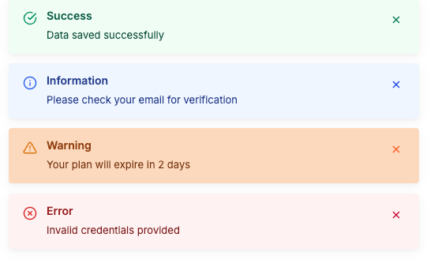
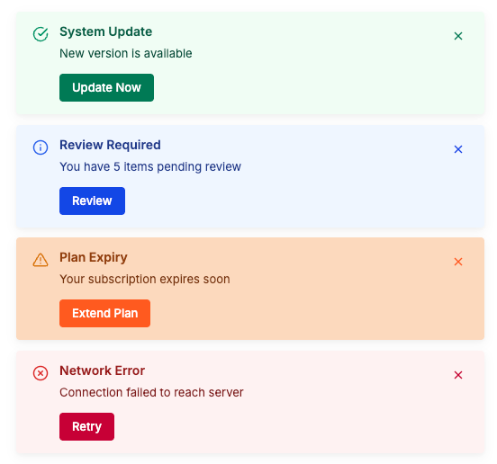

# Alert Library

The Alert Library provides a customizable, dynamic notification system designed to display critical feedback to the user. It functions similarly to popular toast notification libraries but with enhanced flexibility for headers, action buttons, and a clean, modern aesthetic.

## Visual Reference

| Normal Alerts | Alerts with Action Buttons |
| :---: | :---: |
| [](./assets/alert-normal.png) | [](./assets/alert-actions.png) |

*Click on any image to view it in full size.*

---

## Technical Overview

The alert system is managed through a programmatic `AlertService`. All alerts are positioned in a stacked layout at the **bottom-right** of the viewport.

### 1. Core Alert Types
The system supports four primary types, each with distinctive icons and color palettes:
- **Success**: For positive confirmations and successful operations.
- **Information**: For general updates and system notifications.
- **Warning**: For cautionary messages requiring user awareness.
- **Error**: For critical failures, validation issues, or system errors.

### 2. Action Required Pattern
A specialized pattern used when an alert requires immediate user interaction. These alerts:
- Display a prominent **action button**.
- Disable auto-dismissal (staying on screen until acted upon).
- Can be triggered using any of the core types (most commonly `success` or `warning`).

---

## Usage Guide (TypeScript)

Invoke the `AlertService` methods to trigger notifications from any component.

### Basic Notifications
```typescript
import { AlertService } from '@libs/alert';

constructor(private alertService: AlertService) {}

// Simple message
this.alertService.success('Data saved successfully');

// With a custom heading
this.alertService.info('Please check your email for verification', 'Information');
```

### Alert with Action Button
Include an action button and a callback to handle user interaction. Common examples include "Confirm", "Retry", or "Undo".

```typescript
this.alertService.success(
  'Alert with action button',
  'Action Required',
  'Confirm',
  (id) => {
    console.log('Action confirmed for alert:', id);
    // Add logic here
  }
);
```

---

## API Reference

### `AlertService` Methods

| Method | Parameters | Description |
| :--- | :--- | :--- |
| `success()` | `message, heading?, actionText?, callback?` | Displays a green success alert. |
| `error()` | `message, heading?, actionText?, callback?` | Displays a red error alert. |
| `warning()` | `message, heading?, actionText?, callback?` | Displays an orange warning alert. |
| `info()` | `message, heading?, actionText?, callback?` | Displays a blue information alert. |

### Configuration Options (`AlertConfig`)

| Property | Type | Description |
| :--- | :--- | :--- |
| `type` | `'success' \| 'error' \| 'warning' \| 'info'` | Determines the visual style. |
| `message` | `string` | The primary content of the alert. |
| `heading` | `string` | (Optional) Bold title displayed above the message. |
| `actionButtonText`| `string` | (Optional) Text for the primary action button. |
| `actionCallback` | `(id: string) => void` | (Optional) Function executed on button click. |
| `duration` | `number` | Time in ms before auto-dismiss (default: 5000ms). |

---

## Layout & Positioning
- **Stacking**: Multiple alerts stack vertically from the bottom-right.
- **Behavior**: Newest alerts appear at the bottom of the stack.
- **Animation**: Alerts slide in from the right and fade out when dismissed.

