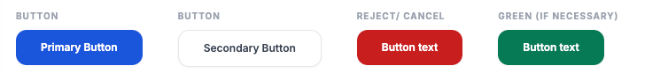
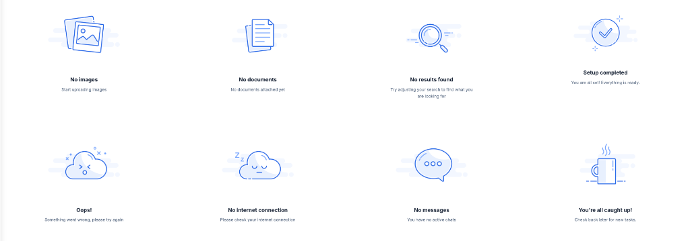
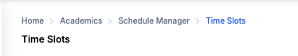
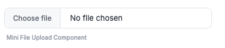
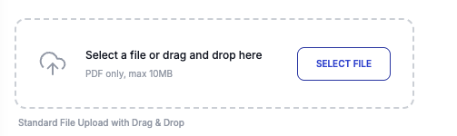
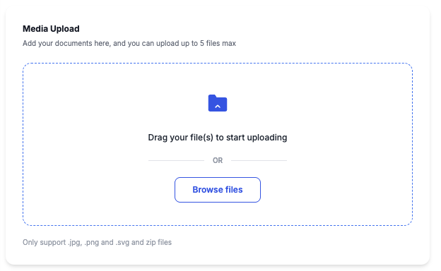

# Shared UI Library

The `shared-ui` library is a collection of atomic, low-level UI components designed to be used globally across all modules in the KJUsys platform. By centralizing these primitive elements, we ensure visual consistency, reduce code duplication, and simplify the development of new features.

## Why Shared UI?

- **Atomicity**: These components represent the smallest building blocks of our design system.
- **Domain Agnostic**: They are purely presentational and can be used in any module (Academics, Finance, HR, etc.) without domain-specific logic.
- **Visual Consistency**: Centralization ensures that core elements like buttons and headers share the same hover effects, shadows, typography, and spacing globally.

---

## How to Use This Library

To use any of these components, you must import the `SharedUiModule` or the specific standalone components into your Angular module or component.

```typescript
import { 
  ButtonComponent, 
  EmptyStateComponent, 
  BreadcrumbsTitleComponent,
  MiniFileuploadComponent,
  FileUploadComponent,
  MediaUploadComponent,
  GeoSelectComponent
} from '@libs/shared-ui';

@Component({
  standalone: true,
  imports: [
    ButtonComponent, 
    EmptyStateComponent, 
    BreadcrumbsTitleComponent,
    MiniFileuploadComponent,
    FileUploadComponent,
    MediaUploadComponent,
    GeoSelectComponent
  ],
  // ...
})
```

---

## 1. Button Component

The Button component is the primary interaction element, supporting multiple variants and states.

### Visual Reference


### API Reference
**Selector:** `lib-button`

| Property | Type | Default | Description |
| :--- | :--- | :--- | :--- |
| `label` | `string` | `'Button'` | The text displayed on the button. |
| `type` | `'primary' \| 'secondary' \| 'reject' \| 'green'` | `'primary'` | The visual variant. |
| `disabled` | `boolean` | `false` | Whether the button is interactive. |
| `loading` | `boolean` | `false` | When true, shows a spinner and disables interaction. |
| `customClass` | `string` | `''` | Additional CSS classes. |

**Outputs:**
- `onClick`: Emitted when the button is clicked.

> [!NOTE]
> The `onClick` event is automatically throttled; it will not emit if the button is in a `disabled` or `loading` state.

### Usage Example
```html
<lib-button label="Save" (onClick)="onSave()"></lib-button>
<lib-button label="Processing" [loading]="true"></lib-button>
<lib-button label="Cancel" type="reject"></lib-button>
```

---

## 2. Empty State Component

Used to provide visual feedback and context when a section or page has no data to display.

### Visual Reference


### API Reference
**Selector:** `lib-empty-state`

| Property | Type | Default | Description |
| :--- | :--- | :--- | :--- |
| `type` | `EmptyStateType` | `'no-results'` | Determines the illustration and default title. |
| `title` | `string` | `''` | Overrides the default title. |
| `subtext` | `string` | `''` | Descriptive text below the title. |

### Usage Example
```html
<lib-empty-state type="no-results" subtext="Try adjusting your filters."></lib-empty-state>
```

---

## 3. Breadcrumbs Title Component

A standardized header component that combines navigation hierarchy and the current page title.

### Visual Reference


### API Reference
**Selector:** `lib-breadcrumbs-title`

| Property | Type | Default | Description |
| :--- | :--- | :--- | :--- |
| `title` | `string` | `''` | Large page title. |
| `breadcrumbs`| `Breadcrumb[]` | `[]` | Array of labels and navigation callbacks. |

### Usage Example
```typescript
breadcrumbs = [
  { label: 'Home', callback: () => navigate('/') },
  { label: 'Users' }
];
```
```html
<lib-breadcrumbs-title title="User Management" [breadcrumbs]="breadcrumbs"></lib-breadcrumbs-title>
```

---

## 4. Mini File Upload Component

A compact file upload component designed for use within tight spaces, such as forms or tables. It mimics a standard browser file input but with a modernized, consistent aesthetic.

### Visual Reference


### API Reference
**Selector:** `lib-mini-fileupload`

| Property | Type | Default | Description |
| :--- | :--- | :--- | :--- |
| `height` | `string` | `'35px'` | The height of the input container. |
| `width` | `string` | `'100%'` | The width of the input container. |
| `accept` | `string` | `'*'` | Comma-separated list of accepted file extensions or MIME types. |
| `placeholder` | `string` | `'No file chosen'` | Text displayed when no file is selected. |
| `typeHint` | `string` | `''` | Small hint text displayed below or within the component. |
| `showTypeHint` | `boolean` | `false` | Whether to display the `typeHint`. |

**Outputs:**
- `fileChange`: Emits the selected `File` object or `null` if cleared.

### Usage Example
```html
<lib-mini-fileupload 
  width="350px" 
  accept=".pdf,.doc"
  (fileChange)="onFileSelect($event)">
</lib-mini-fileupload>
```

---

## 5. File Upload Component

The standard file upload component for most use cases. It supports both manual selection and drag-and-drop functionality, providing clear visual feedback during interactions.

### Visual Reference


### API Reference
**Selector:** `lib-file-upload`

| Property | Type | Default | Description |
| :--- | :--- | :--- | :--- |
| `accept` | `string` | `'*'` | Comma-separated list of accepted file extensions or MIME types. |
| `width` | `string` | `'440px'` | The width of the upload container. |
| `title` | `string` | `'Select a file...'` | The primary instruction text. |
| `hint` | `string` | `'PDF file size...'` | Secondary text providing constraints or hints. |

**Outputs:**
- `fileChange`: Emits the selected `File` object or `null` if cleared.

### Usage Example
```html
<lib-file-upload 
  accept=".pdf" 
  hint="PDF only, max 10MB"
  (fileChange)="onFileUpload($event)">
</lib-file-upload>
```

---

## 6. Media Upload Component

An advanced multi-file upload component specialized for images and documents. It features a large drop zone, file limit enforcement, size validation, and real-time image previews.

### Visual Reference


### API Reference
**Selector:** `lib-media-upload`

| Property | Type | Default | Description |
| :--- | :--- | :--- | :--- |
| `title` | `string` | `'Media Upload'` | The main header of the component. |
| `subtitle` | `string` | `'Add your docs...'` | Descriptive text below the title. |
| `hint` | `string` | `'Only support...'` | Constraint information displayed at the bottom. |
| `maxFiles` | `number` | `5` | Maximum number of files allowed. |
| `maxSizeMB` | `number` | `10` | Maximum size per file in megabytes. |
| `accept` | `string` | `'.jpg,.jpeg...'` | Accepted file extensions. |

**Outputs:**
- `filesChanged`: Emits an array of `File[]` objects whenever the selection changes.
- `close`: Emits when the user clicks the close action (if applicable).

### Usage Example
```html
<lib-media-upload 
  [maxFiles]="3" 
  (filesChanged)="onFilesUpdate($event)"
  (close)="onModalClose()">
</lib-media-upload>
```

---

## 7. Geo Select Component

A specialized dropdown component for selecting geographical data (Countries, States, Districts) with built-in API integration and filtering.

### API Reference
**Selector:** `lib-geo-select`

| Property | Type | Default | Description |
| :--- | :--- | :--- | :--- |
| `type` | `'country' \| 'state' \| 'district'` | `'country'` | The level of geographical data to fetch. |
| `countryCode` | `string` | `''` | Required if `type` is `state` or `district`. |
| `stateCode` | `string` | `''` | Required if `type` is `district`. |
| `label` | `string` | `''` | Visual label displayed above the select. |
| `placeholder` | `string` | `'Select...'` | Placeholder text when no item is selected. |
| `disabled` | `boolean` | `false` | Whether the component is interactive. |
| `selectedValue` | `any` | `null` | The currently selected value/object. |
| `customWidth` | `string` | `''` | Optional CSS width (e.g., `'200px'`). |
| `customHeight` | `string` | `'35px'` | Optional CSS height. |
| `bindValue` | `string` | `''` | Property to emit (e.g., `'isoCode'`). If empty, emits full object. |
| `bindLabel` | `string` | `'name'` | Property to display in the list. |
| `normalizePhone`| `boolean` | `false` | If true, normalizes `phonecode` if present in the data. |

**Outputs:**
- `onSelectionChange`: Emitted when a selection is made.

### Usage Example
```html
<lib-geo-select 
  type="state" 
  [countryCode]="selectedCountry"
  label="State"
  (onSelectionChange)="onStateSelect($event)">
</lib-geo-select>
```

