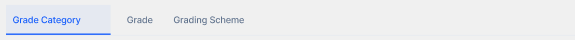

# Sub-Tabs Library

The Sub-Tabs Library is a lightweight navigation component designed for secondary layers of information. It provides a clean, understated aesthetic that complements the primary Tabs Library while maintaining essential features like overflow detection and smooth scrolling.

## Visual Reference

| Sub-Tabs Implementation |
| :---: |
| [](./assets/sub-tabs.png) |

*Click on the image to view it in full size.*

---

## Technical Overview

The sub-tabs component (`lib-sub-tabs`) is a data-driven navigation tool residing in the `@libs/sub-tabs` package. It is intended for use within modules or individual pages to organize sub-content without visual competition with primary navigation elements.

### Key Features
- **Secondary Aesthetic**: Features a subtle blue theme with a refined 11px font size.
- **Overflow Detection**: Automatically manages navigation arrows when tab content exceeds the viewport width.
- **Integrated Background**: Includes a faint slate background (`bg-slate-50/30`) to distinguish the navigation area.
- **Auto-Scrolling**: Automatically slides the active tab to the leftmost position for better visibility when selected.
- **Smooth Interaction**: Supports standard horizontal scrolling and programmatic arrow-based navigation.

---

## Usage Guide (Angular)

### 1. Define Sub-Tab Data
In your component TypeScript, define the array of sub-tabs using the `SubTabItem` model.

```typescript
import { SubTabItem } from '@libs/sub-tabs';

public secondaryTabs: SubTabItem[] = [
  { id: 'grade-category', label: 'Grade Category', count: 5 },
  { id: 'grade', label: 'Grade' },
  { id: 'grading-scheme', label: 'Grading Scheme' }
];

public activeSubTabId: string = 'grade-category';

onSubTabChange(tabId: string) {
  this.activeSubTabId = tabId;
}
```

### 2. Implementation in Template
Use the `lib-sub-tabs` component and bind the required inputs and outputs.

```html
<lib-sub-tabs 
  [tabs]="secondaryTabs" 
  [activeTabId]="activeSubTabId" 
  (tabChange)="onSubTabChange($event)">
</lib-sub-tabs>
```

---

## API Reference

### Inputs & Outputs

| Property | Type | Description |
| :--- | :--- | :--- |
| `[tabs]` | `SubTabItem[]` | Required. The array of sub-tab items to be rendered. |
| `[activeTabId]` | `string` | The ID of the currently selected sub-tab. |
| `(tabChange)` | `EventEmitter<string>` | Emits the `id` of the sub-tab when clicked. |

### Data Model (`SubTabItem`)

| Property | Type | Optional | Description |
| :--- | :--- | :--- | :--- |
| `id` | `string` | No | Unique identifier for the sub-tab. |
| `label` | `string` | No | Text label displayed in the UI. |
| `count` | `number` | Yes | Optional numeric indicator for notifications or counts. |

---

## Design Standards

- **Active State**: Subtle blue background (`bg-blue-50/50`) with a solid blue (`#2563eb`) bottom border (2px) and medium weight text.
- **Inactive State**: Slate-500 text with transparent background; transitions to blue-600 and a light gray background on hover.
- **Count Badge**: Displayed in an "exponent" style with a blue background (`bg-blue-600`), white text, and a circular shape.
- **Typography**: Optimized at `11px` (`text-[11px]`) to maintain a clear hierarchy below primary page headers.
- **Layout**: Features a bottom border on the entire container to define the navigation boundary.
