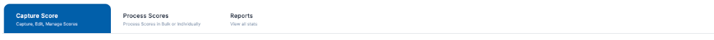

# Tabs Library

The Tabs Library provides a flexible, data-driven navigation system designed for high-density interfaces. It features automatic overflow detection, smooth horizontal scrolling, and integrated navigation controls to handle any number of tabs within a restricted viewport.

## Visual Reference

| Tabs Implementation |
| :---: |
| [](./assets/tabs.png) |

*Click on the image to view it in full size.*

---

## Technical Overview

The tabs component (`lib-tabs`) is built to be completely independent and data-driven. It resides in the `@libs/tabs` package and is designed to integrate seamlessly into any Angular application.

### Key Features
- **Overflow Detection**: Automatically detects when tabs exceed the container width.
- **Dynamic Navigation**: Displays left/right navigation arrows only when needed.
- **Themed Shadows**: Uses blue-themed gradients to indicate further scrollable content.
- **Auto-Scrolling**: Automatically slides the active tab to the leftmost position for better mobile responsiveness and visibility.
- **Responsive**: Adapts to window resizing and dynamic data updates.

---

## Usage Guide (Angular)

### 1. Define Tab Data
In your component TypeScript, define the array of tabs using the `TabItem` model.

```typescript
import { TabItem } from '@libs/tabs';

public myTabs: TabItem[] = [
  { id: 'capture', label: 'Capture Score', subtitle: 'Capture, Edit, Manage Scores', count: 12 },
  { id: 'process', label: 'Process Scores', subtitle: 'Process Scores in Bulk or Individually' },
  { id: 'reports', label: 'Reports', subtitle: 'View all stats' }
];

public selectedTabId: string = 'capture';

onTabChange(tabId: string) {
  this.selectedTabId = tabId;
  // Handle tab switching logic here
}
```

### 2. Implementation in Template
Use the `lib-tabs` component and bind the required inputs and outputs.

```html
<lib-tabs 
  [tabs]="myTabs" 
  [activeTabId]="selectedTabId" 
  [autoWidth]="true"
  (tabChange)="onTabChange($event)">
</lib-tabs>
```

---

## API Reference

### Inputs & Outputs

| Property | Type | Description |
| :--- | :--- | :--- |
| `[tabs]` | `TabItem[]` | Required. The array of tabs to be rendered. |
| `[activeTabId]` | `string` | The ID of the currently selected tab for styling. |
| `[autoWidth]` | `boolean` | If true, tabs will take the width of their content instead of a fixed 220px. |
| `(tabChange)` | `EventEmitter<string>` | Emits the `id` of the tab when clicked. |

### Data Model (`TabItem`)

| Property | Type | Optional | Description |
| :--- | :--- | :--- | :--- |
| `id` | `string` | No | Unique identifier for selection logic. |
| `label` | `string` | No | Primary text displayed on the tab (Title case). |
| `subtitle` | `string` | Yes | Small secondary text displayed below the label. |
| `count` | `number` | Yes | Numeric indicator for notifications or counts. |

---

## Design Standards

- **Active State**: Deep blue background (`#005faa`) with white text and inner shadow for depth.
- **Inactive State**: Slate-700 text with transparent background and a subtle gray-200 border on top and sides.
- **Count Badge**: High-visibility red background (`bg-red-600`) with white text, positioned as an exponent to the label.
- **Typography**: Labels use `text-xs font-medium` while subtitles use `text-[9px] font-normal`.
- **Navigation Arrows**: Visible only on overflow; features a blue gradient overlay (`from-blue-300/95`) to indicate scrollability.
- **Transitions**: 300ms smooth transition for hover and selection states.
- **Content Rules**:
    - **Labelling**: Exactly **2 words** per tab label (e.g., "Capture Score", "Process Scores"). This ensures consistent button widths and alignment.
    - **Subtitles**: Maximum **3 to 4 words**. Subtitles must be concise to prevent multi-line wrapping or text truncation within the fixed-width tab container (`220px`).

> [!TIP]
> Following these word count limits prevents visual clutter and ensures that the navigation arrows and shadows function correctly without being obscured by excessive text.
