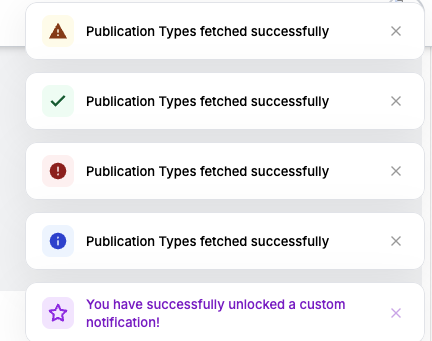

A customizable, and responsive toast notification library for Angular. It provides built-in notifications for success, error, warning, and info states, alongside support for fully custom toasts.

Features
Multiple Notification Types:Built-in support for `success`, `error`, `warning`, and `info` messages, each styled with intuitive colors and SVG icons.
Custom Toasts:Create completely custom notifications with personalized background colors, text colors, and custom SVG icons.
Auto-Dismissal & Smart Timers:Toasts automatically disappear after 5 seconds.
Pause on Hover:The timer automatically pauses when the user hovers over a toast, ensuring they have enough time to read the message, and resumes when the cursor leaves.
Smooth Animations:Smooth and professional slide-in/slide-out Angular animations for a premium user experience.
Manual Dismissal:Users can manually close notifications instantly by clicking the 'X' button or anywhere on the toast.
Standalone Support: The component is built as an Angular standalone component but can easily be imported via its module.

Visual Reference



Installation & Setup
1. Import the module into your app module, a core module, or directly into a standalone component. It is recommended to place the `<shared-toast></shared-toast>` component in your root `app.component.html` so it overlays globally.

import { SharedToastModule } from '@libs/shared-toast';

@NgModule({
  declarations: [
    // ...
  ],
  imports: [
    // ... other imports
    SharedToastModule
  ]
})
export class AppModule { }

2. Add the component to your root layout (e.g., `app.component.html`):

html
<shared-toast></shared-toast>
<router-outlet></router-outlet> <!-- Or your main app layout -->


### Usage Examples

Inject the `SharedToastService` into your component or service to trigger notifications.

#### 1. Basic Notifications (Success, Error, Warning, Info)

```typescript
import { Component } from '@angular/core';
import { SharedToastService } from '@libs/shared-toast';

@Component({
  selector: 'app-user-profile',
  templateUrl: './user-profile.component.html'
})
export class UserProfileComponent {

  constructor(private toastService: SharedToastService) {}

  saveProfile() {
    // API call simulation...
    this.toastService.success('Profile updated successfully!');
  }

  handleError() {
    this.toastService.error('Failed to update profile. Please try again.');
  }

  showWarning() {
    this.toastService.warning('Your session is about to expire.');
  }

  showInfo() {
    this.toastService.info('New updates are available.');
  }
}
```

#### 2. Custom Notifications

You can pass a custom configuration to override icons and colors.

```typescript
triggerCustomToast() {
  this.toastService.custom({
    message: 'File upload completed.',
    iconSvg: '<svg>...</svg>', // Your custom SVG string here
    iconBgColor: '#e0e7ff',    // Custom background for the icon
    textColor: '#3730a3'       // Custom text color
  });
}
```

### API Reference

#### `SharedToastService` Methods

| Method | Parameters | Description |
| :--- | :--- | :--- |
| `success(message: string, title?: string)` | `message`, `title` (optional) | Triggers a green success notification with a checkmark icon. |
| `error(message: string, title?: string)` | `message`, `title` (optional) | Triggers a red error notification with an alert icon. |
| `warning(message: string, title?: string)` | `message`, `title` (optional) | Triggers a yellow/orange warning notification with an alert icon. |
| `info(message: string, title?: string)` | `message`, `title` (optional) | Triggers a blue info notification with an information icon. |
| `custom(toast: Omit<ToastMessage, 'id' \| 'type'>)` | `message`, `iconSvg`, `iconBgColor`, `textColor`, `title` | Triggers a fully custom notification allowing you to define your own colors and SVGs. |

*(Note: The library relies heavily on a Service-based approach rather than `@Input()` bindings, as notifications are invoked programmatically.)*